# Graf Betimleme Dili: DOT

## Giriş

Bazı zeki insanlar bilgisayar bilimleri mezunlarının çizimde pek iyi olmadıklarını ama yine de çoğu zaman graf çizmeleri gerektiğini fark etti. Bu soylu ruhlar bizim graf çizebilmemiz için GraphViz adlı bir program yaptılar.

Ücretsiz, açık kaynak kodlu ve harika olan bu yazılımın tek kusuruysa kullanımının inanılmaz derecede kolay olmamasıydı. Bu yüzden tezlerimiz, makalelerimiz ve ödevlerimiz için graf çizimimizi kolaylaştırmak için internetteki bazı güzel kaynaklardan yararlanarak bu belgeyi hazırladım.

## DOT Dili

DOT, bir graf betimleme dilidir. DOT grafları genellikle `gv` veya `dot` uzantılı dosyalarda yer alır. Microsoft Word'ün 2007 öncesindeki sürümlerinde kullanılan `dot` uzantılı dosyalarla karışıklığı önlemek için `gv` uzantısı tercih edilir.

Çeşitli programlar DOT dosyalarını işleyebilir. Örneğin `dot`, `neato`, `twopi`, `circo`, `fdp` ve `sfdp` gibi çeşitli uygulamalar DOT dosyasını okuyabilir ve grafiksel biçimlere dönüştürebilir. `gvpr`, `gc`, `asyclic`, `ccomps`, `sccmap` ve `tred` gibi bazı uygulamalar da DOT dosyalarını okuyup temsil edilen graflar üzerinde hesaplamalar yapar. Son olarak, `lefty`, `dotty` ve `grappa` gibi uygulamalar da DOT dosyaları için etkileşimli bir arayüz sağlar. `GVedit` aracıysa etkileşimli olmayan bir grafik görüntüleyiciyle bir DOT dosya düzenleyicisini birleştirir. Bu sayılan programların çoğu [Graphviz](https://www.graphviz.org/) paketinin bir parçasıdır ya da bu paketteki araçlardan bazılarını kullanır.

Fedora'da GVedit [çeşitli nedenlerle](https://ask.fedoraproject.org/en/question/27516/where-is-gvedit/) bulunmamaktadır, bu uygulama yerine [KGraphViewer](https://www.kde.org/applications/graphics/kgraphviewer/) ile [Kate](https://kate-editor.org/)'i birlikte kullanabilirsiniz.

## Grafları Anlamak

İlk grafımızı çizmeye başlamadan önce, teknik olmayan bir şekilde grafların ne olduğunu anlayalım. G grafı, köşeler adı verilen bir düğüm grubundan ve bir çift köşeyi birbirine bağlayan bir dizi kenardan oluşur. Grafta kenarların yönü varsa, graf yönlü bir graf; aksi halde, graf yönsüz bir graftır.

## dot Aracını Kullanarak Grafik Oluşturmak

Kate'i veya favori metin düzenleyicinizi grafiğini oluşturmak istediğiniz grafı yazın. Örnek olarak aşağıdaki grafı da kullanabilirsiniz. Grafı yazmayı bitirdikten sonra ilkgraf.gs veya istediğiniz başka bir isimle kaydedin.

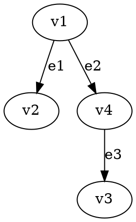

Grafiği PDF biçiminde oluşturmak için şu komutu çalıştırın:

```bash
$ dot ilkgraf.gs -Tpdf -o firstgraph.pdf
```

Grafiği PNG biçiminde oluşturmak içinse şu komutu çalıştırın:

```bash
$ dot ilkgraf.gs -Tpng -o firstgraph.png
```

Grafiği SVG biçiminde oluşturmak içinse şu komutu çalıştırın:

```bash
$ dot ilkgraf.gs -Tsvg -o firstgraph.svg
```

Oluşturulan grafiği görmek için de oluşturduğunuz dosyaya uygun olarak bir görüntüleyiciyi kullanabilirsiniz.


## DOT Sözdizimi

### Yönsüz Graflar

En basit haliyle DOT, yönsüz bir grafı tanımlamak için kullanılabilir. Yönsüz bir graf, insanlar arasındaki arkadaşlık gibi nesneler arasındaki temel ilişkileri gösterir. `graph` anahtar sözcüğü yeni bir grafa başlamak için kullanılır ve düğümler küme parantezleri içinde tanımlanır. Düğümler arasındaki ilişkileri göstermek için çift tire `--` kullanılır.

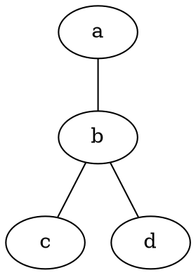

### Yönlü Graflar

Yönsüz graflara benzer şekilde DOT, akış çizelgeleri ve bağımlılık ağaçları gibi yönlü grafları da tanımlayabilir. Sözdizimi, grafa başlamak için `digraph` anahtar sözcüğünün kullanılması ve düğümler arasındaki ilişkileri göstermek için bir ok `->` kullanılması dışında yönsüz graflarla aynıdır.

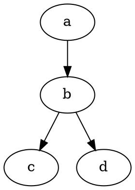

### Öznitellikler
DOT dosyalarındaki graflara, düğümlere ve kenarlara çeşitli öznitelikler uygulanabilir. Bu özniteliklerle renk, şekil ve çizgi stilleri gibi özellikler kontrol edebilir. Düğümler ve kenarlar için, bir veya daha çok öznitelik-değer çifti, köşeli parantez `[]` içinde bir ifadeden sonra ve isteğe bağlı olan noktalı virgül kullanılmışsa ondan önce yerleştirilir.

Graf özellikleri, graf öğesinin altında doğrudan öznitelik-değer çiftleri olarak belirtilir; burada birden çok özellik virgülle veya çoklu köşeli parantez kullanılarak ayrılır. Düğüm öznitelikleriyse yalnızca düğümün adını içeren, ancak noktalar arasındaki ilişkileri içermeyen bir ifadeden sonra yerleştirilir.

```dot
graph graphname {
    // Bu öznitelik grafın kendisi için geçerlidir.
    size="1,1";
    // Bir düğümün etiketini değiştirmek için label özniteliği kullanılabilir
    a [label="Foo"];
    // Burada, düğümün şekli değiştirildi
    b [shape=box];
    // Bu kenarların her ikisi de farklı çizgi özelliklerine sahip
    a -- b -- c [color=blue];
    b -- d [style=dotted];
    // [style=invis] bir düğümü gizler
}
```

HTML benzeri etiketler, yalnızca Kasım 2003'ten sonraki Graphviz sürümlerinde bulunur ve 1.10 sürümünün bir parçası olarak kabul edilmez.

### Yorumlar

Dot, `C` ve `C++` tarzı tek satır ve çok satırlı yorumları destekler. Ayrıca, ilk karakterleri bir sayı işareti sembolü `#` olan satırlar da görmezden gelinir.

```dot
// Bu tek satırlı bir yorumdur
/* Bu bir
   çok satırlı
   yorumdur. */
# Bunun gibi satırlar da göz ardı edilir
```

## Örnekler

### Örnek 0. Merhaba Dünya

```dot
graph {
    Merhaba -> Dünya
}
```

### Örnek 1. Basit bir graf

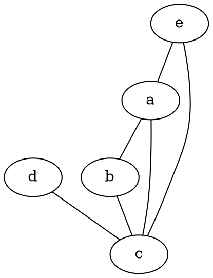

### Örnek 2. K6

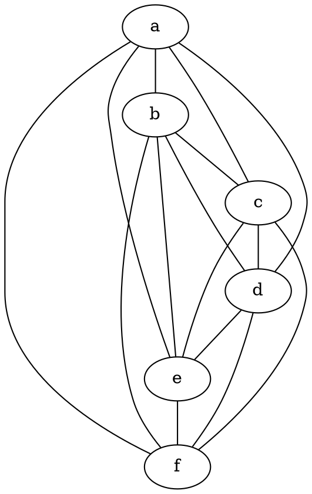

### Örnek 3. Basit bir yönlü graf

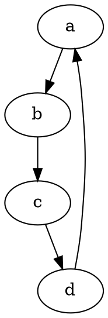

### Örnek 4. Ağırlıklı bir graf

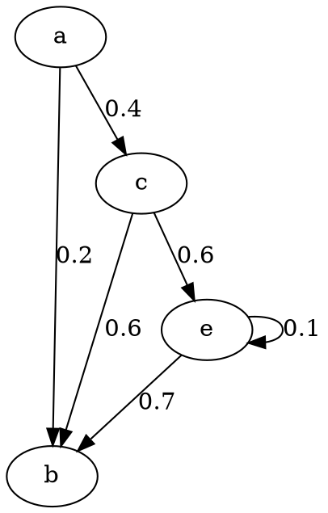

### Örnek 5. Bir yolun gösterimi

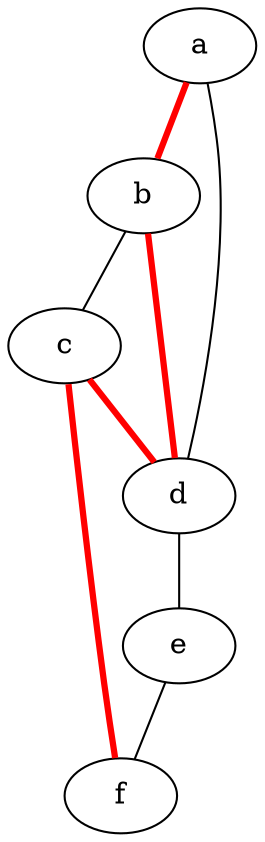

Aşağıdaki gibi bir kestirme yöntem bulunduğunu da unutmayın:

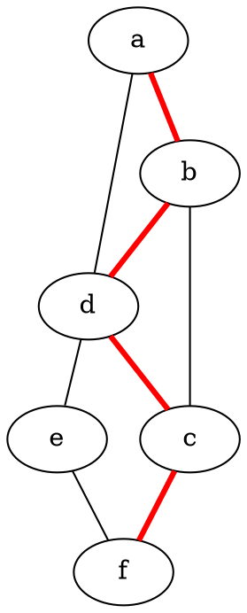

### Örnek 6. Alt graflar

Lütfen burada bazı tuhaflıklar olduğunu unutmayın. Öncelikle alt grafların adı önemlidir, görsel olarak ayrılması için, aşağıda gösterildiği gibi cluster_ ön adının eklenmesi gerekir. Ayrıca yalnızca DOT ve FDP yerleşim yöntemleri alt grafları desteklemektedir.

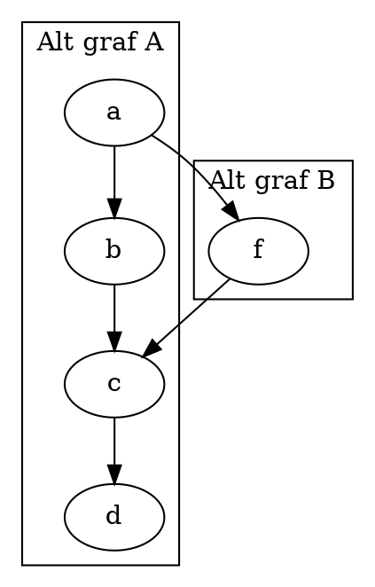

Aşağıdaki örnekteyse düğümler kendi kenarlarından ayrı olarak gruplandırılmıştır. Ayrıca splines=line; ile kenarların sadece düz çizgiler olarak çizilmesi gerektiğini, hiçbir eğriye izin verilmediği belirtilmiştir.

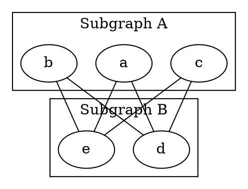

### Örnek 7. Büyük graflar

Büyük graf tanımlamalarını yazmayı kolaylaştırmak için kenarlar bir küme paranteziyle birlikte gruplanabilir. Ayrıca grafın yukarıdan aşağıya doğru yerleştirilmesi yerine soldan sağa doğru yerleştirilmesi de yardımcı olabilir.

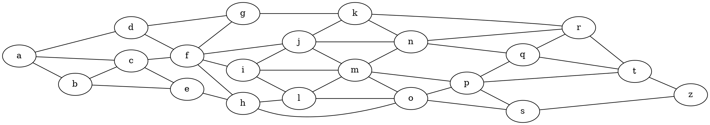

Büyük grafların yönetilebilir hale getirebilecek başka bir özellik de düğümleri aynı sütunda gruplamaktır:

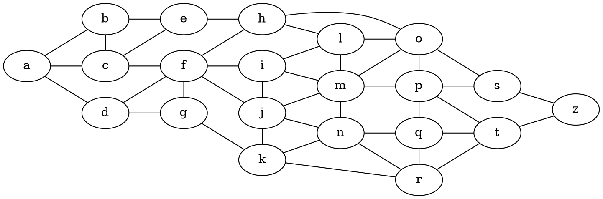

### Örnek 8. Etan molekülü

Aşağıda bir etan molekülünün bağ yapısını tanımlayan bir örnek kod verilmiştir. Bu, yönsüz bir graftır ve yukarıda açıklandığı gibi düğüm öznitelikleri içerir.

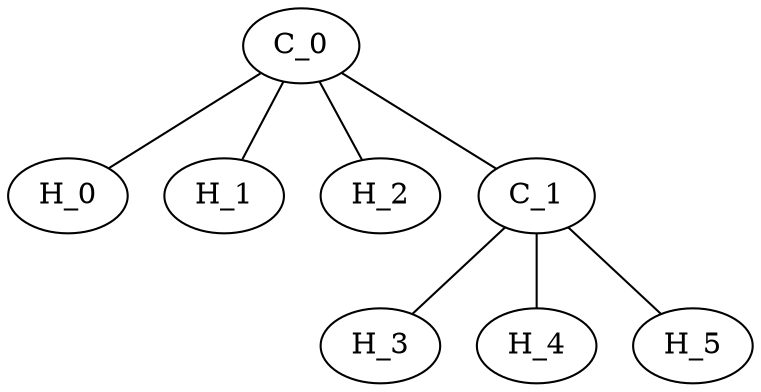

## Sınırlamalar
DOT ile yerleşim ayrıntılarını belirtmek mümkündür ancak DOT dilini gerçekleyen araçların tümü konum özelliklerine dikkat etmez. Bu nedenle, kullanılan araçlara bağlı olarak, kullanıcılar otomatik yerleşim algoritmalarına (potansiyel olarak beklenmeyen çıktılara yol açabilir) dayalı çözümler kullanmak veya sıkıcı olabilecek ve zaman alabilecek şekilde düğümleri elle konumlandırmak zorunda kalabilir.

Örneğin:

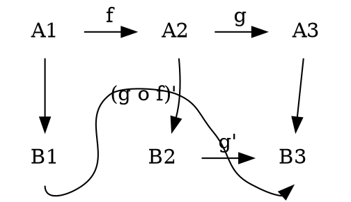

Yukarıdaki resimde iki sorun var. Sağdaki kare mükemmel bir kare değil ve etiketler yanlış yerde.

Bu sorun Inkscape veya diğer SVG düzenleyicilerle düzeltilebilir. Bazı durumlarda bu, bir konum belirtmek için pos özniteliği ve grafı kare olarak oluşturmak için weight özniteliği kullanılarak da düzeltilebilir.

## Kaynaklar

- [DOT (graph description language) - Wikipedia](https://en.wikipedia.org/wiki/DOT_(graph_description_language))
- [GraphViz Pocket Reference](https://graphs.grevian.org)
- [Graphviz Example: Hello World](https://graphviz.gitlab.io/_pages/Gallery/directed/hello.html)
- [DOT: A Language that Helps You to Draw Graphs](https://opensourceforu.com/2016/01/dot-a-language-that-helps-you-to-draw-graphs/)

