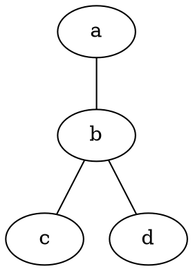
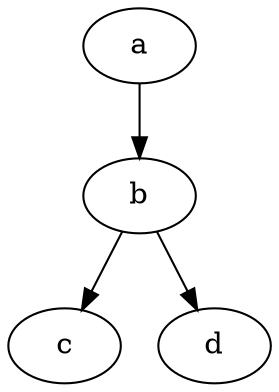
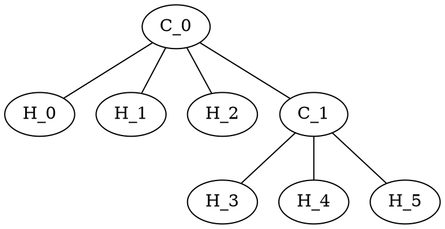
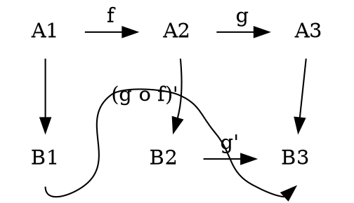

# Graf Betimleme Dili: DOT

DOT, bir graf betimleme dilidir. DOT grafları genellikle `gv` veya `dot` uzantılı dosyalarda yer alır. Microsoft Word'ün 2007 öncesindeki sürümlerinde kullanılan `dot` uzantılı dosyalarla karışıklığı önlemek için `gv` uzantısı tercih edilir.

Çeşitli programlar DOT dosyalarını işleyebilir. Örneğin `dot`, `neato`, `twopi`, `circo`, `fdp` ve `sfdp` gibi çeşitli uygulamalar DOT dosyasını okuyabilir ve grafiksel biçimlere dönüştürebilir. `gvpr`, `gc`, `asyclic`, `ccomps`, `sccmap` ve `tred` gibi bazı uygulamalar da DOT dosyalarını okuyup temsil edilen graflar üzerinde hesaplamalar yapar. Son olarak, `lefty`, `dotty` ve `grappa` gibi uygulamalar da DOT dosyaları için etkileşimli bir arayüz sağlar. `GVedit` aracıysa etkileşimli olmayan bir grafik görüntüleyiciyle bir DOT dosya düzenleyicisini birleştirir. Bu sayılan programların çoğu [Graphviz](https://www.graphviz.org/) paketinin bir parçasıdır ya da bu paketteki araçlardan bazılarını kullanır.

Fedora'da GVedit [çeşitli nedenlerle](https://ask.fedoraproject.org/en/question/27516/where-is-gvedit/) bulunmamaktadır, bu uygulama yerine [KGraphViewer](https://www.kde.org/applications/graphics/kgraphviewer/) ile [Kate](https://kate-editor.org/)'i birlikte kullanabilirsiniz.

## DOT Sözdizimi

### Yönsüz Graflar

En basit haliyle DOT, yönsüz bir grafı tanımlamak için kullanılabilir. Yönsüz bir graf, insanlar arasındaki arkadaşlık gibi nesneler arasındaki temel ilişkileri gösterir. `graph` anahtar sözcüğü yeni bir grafa başlamak için kullanılır ve düğümler küme parantezleri içinde tanımlanır. Düğümler arasındaki ilişkileri göstermek için çift tire `--` kullanılır.



### Yönlü Graflar

Yönsüz graflara benzer şekilde DOT, akış çizelgeleri ve bağımlılık ağaçları gibi yönlü grafları da tanımlayabilir. Sözdizimi, grafa başlamak için `digraph` anahtar sözcüğünün kullanılması ve düğümler arasındaki ilişkileri göstermek için bir ok `->` kullanılması dışında yönsüz graflarla aynıdır.



### Öznitellikler
DOT dosyalarındaki graflara, düğümlere ve kenarlara çeşitli öznitelikler uygulanabilir. Bu özniteliklerle renk, şekil ve çizgi stilleri gibi özellikler kontrol edebilir. Düğümler ve kenarlar için, bir veya daha çok öznitelik-değer çifti, köşeli parantez `[]` içinde bir ifadeden sonra ve isteğe bağlı olan noktalı virgül kullanılmışsa ondan önce yerleştirilir.

Graf özellikleri, graf öğesinin altında doğrudan öznitelik-değer çiftleri olarak belirtilir; burada birden çok özellik virgülle veya çoklu köşeli parantez kullanılarak ayrılır. Düğüm öznitelikleriyse yalnızca düğümün adını içeren, ancak noktalar arasındaki ilişkileri içermeyen bir ifadeden sonra yerleştirilir.

```dot
graph graphname {
    // Bu öznitelik grafın kendisi için geçerlidir.
    size="1,1";
    // Bir düğümün etiketini değiştirmek için label özniteliği kullanılabilir
    a [label="Foo"];
    // Burada, düğümün şekli değiştirildi
    b [shape=box];
    // Bu kenarların her ikisi de farklı çizgi özelliklerine sahip
    a -- b -- c [color=blue];
    b -- d [style=dotted];
    // [style=invis] bir düğümü gizler
}
```



HTML benzeri etiketler, yalnızca Kasım 2003'ten sonraki Graphviz sürümlerinde bulunur ve 1.10 sürümünün bir parçası olarak kabul edilmez.

### Yorumlar

Dot, `C` ve `C++` tarzı tek satır ve çok satırlı yorumları destekler. Ayrıca, ilk karakterleri bir sayı işareti sembolü `#` olan satırlar da görmezden gelinir.

```dot
// Bu tek satırlı bir yorumdur
/* Bu bir
   çok satırlı
   yorumdur. */
# Bunun gibi satırlar da göz ardı edilir
```

## Örnekler

Aşağıda bir etan molekülünün bağ yapısını tanımlayan bir örnek kod verilmiştir. Bu, yönsüz bir graftır ve yukarıda açıklandığı gibi düğüm öznitelikleri içerir.



## Sınırlamalar
DOT ile yerleşim ayrıntılarını belirtmek mümkündür ancak DOT dilini gerçekleyen araçların tümü konum özelliklerine dikkat etmez. Bu nedenle, kullanılan araçlara bağlı olarak, kullanıcılar otomatik yerleşim algoritmalarına (potansiyel olarak beklenmeyen çıktılara yol açabilir) dayalı çözümler kullanmak veya sıkıcı olabilecek ve zaman alabilecek şekilde düğümleri elle konumlandırmak zorunda kalabilir.

Örneğin:



Yukarıdaki resimde iki sorun var. Sağdaki kare mükemmel bir kare değil ve etiketler yanlış yerde.

Bu sorun Inkscape veya diğer SVG düzenleyicilerle düzeltilebilir. Bazı durumlarda bu, bir konum belirtmek için pos özniteliği ve grafı kare olarak oluşturmak için weight özniteliği kullanılarak da düzeltilebilir.

## Kaynaklar

- [DOT (graph description language) - Wikipedia](https://en.wikipedia.org/wiki/DOT_(graph_description_language))

