# Graf Betimleme Dili: DOT

## Giriş

Bazı zeki insanlar bilgisayar bilimleri mezunlarının çizimde pek iyi olmadıklarını ama yine de çoğu zaman graf çizmeleri gerektiğini fark etti. Bu soylu ruhlar bizim graf çizebilmemiz için GraphViz adlı bir program yaptılar.

Ücretsiz, açık kaynak kodlu ve harika olan bu yazılımın tek kusuruysa kullanımının inanılmaz derecede kolay olmamasıydı. Bu yüzden tezlerimiz, makalelerimiz ve ödevlerimiz için graf çizimimizi kolaylaştırmak için internetteki bazı güzel kaynaklardan yararlanarak bu belgeyi hazırladım.

Kaynak olarak kullanmak isterseniz [How do you cite a Github repository?](https://academia.stackexchange.com/a/14015) sorusuna verilmiş cevaplara bakmayı unutmayın.

## Graphviz: Graf Görselleştirme Yazılımı

Graphviz, AT&T Labs Research tarafından DOT graf tanımlama dilinde belirtilen grafları çizmek için başlatılan ve Eclipse Kamu Lisansıyla dağıtılan özgür bir araç paketidir. Ayrıca, sunduğu araçların diğer yazılımlarca kullanımı için kütüphaneler de sağlar.

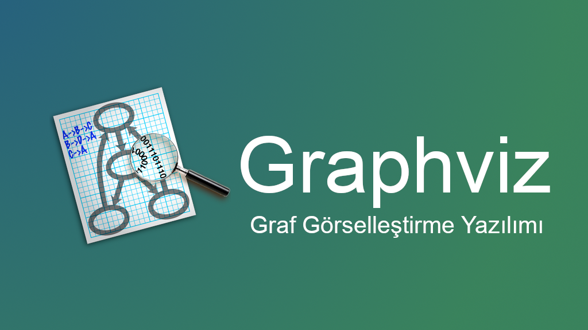

### Graphviz

Graphviz özgür bir graf görselleştirme yazılımıdır. Graf görselleştirme, yapısal bilgiyi soyut graf ve ağ diyagramları olarak temsil etmenin bir yoludur. Ağ oluşturma, biyoinformatik, yazılım mühendisliği, veritabanı ve web tasarımı, makine öğrenmesi ve çeşitli diğer teknik alanlarda önemli uygulamalara sahiptir.

### Graphviz'in Özellikleri

Graphviz yerleşim planı programları, basit bir metin dosyasındaki graf açıklamalarını alır ve faydalı biçimlerde diyagramlar oluşturur, örneğin: web sayfaları için piksel ve vektör tabanlı görüntüler, diğer belgelere dahil etmek için PDF veya Postscript'ler veya etkileşimli graf görüntüleyiciler için uygun biçimli dosyalar.

Graphviz, diyagramları oluşturmak için renk kullanma, yazı tipi değiştirme, çizgi stilleri ayarlama, bağlantı ekleme ve özel şekiller kullanma gibi birçok kullanışlı özelliğe sahiptir.

Gerçekte, graflar genellikle harici bir veri kaynağından üretilir, ancak bunlar ham metin dosyaları olarak veya bir grafiksel düzenleyici içinde elle de oluşturulabilir ve düzenlenebilir. Graphviz bir Visio karşılığı olmadığı için bu amaçla kullanmayı denemek muhtemelen sinir bozucu olacaktır.

### Graphviz Bileşenleri

- dot - yönlendirilmiş grafların hiyerarşik veya katmanlı çizimleri. Bu, kenarların yönlülüğü varsa kullanılacak öntanımlı araçtır. Yerleşim planı algoritması, kenarların aynı yönde olmasını (yukarıdan aşağıya veya soldan sağa) hedefler ve ardından kenar geçişlerinden kaçınmaya ve kenar uzunluğunu azaltmaya çalışır.

- neato - "spring model" yerleşimleri. Graf çok büyük değilse (yaklaşık 100 düğüm) ve graf hakkında başka bir şey bilmiyorsanız, kullanılacak öntanımlı araçtır. Neato, istatistiksel çok boyutlu ölçeklendirmeye eşdeğer olan küresel bir enerji fonksiyonunu en aza indirmeye çalışır. Çözüm, stress majorization kullanılarak elde edilir, ancak en dik inişi kullanan eski Kamada-Kawai algoritması da mevcuttur.

- fdp - "spring model", neato ile benzer yerleşimlere sahiptir, ancak yerleşimi enerjiyle çalışmak yerine kuvvetleri azaltarak yapar. Fdp, daha büyük grafları işleyen ve yönlendirilmemiş grafları kümeleyen multigrid bir çözücü içeren Fruchterman-Reingold yaklaşımını uygular.

- sfdp - büyük grafların yerleşimi için fdp'nin çok ölçekli sürümü.

- twopi - dairesel yerleşimler. Düğümler, belirli bir kök düğümünden uzaklıklarına bağlı olarak eşmerkezli dairelere yerleştirilir. Kök düğüm ayarlanabilir veya twopi'nin yapmasına izin verilebilir.

- circo - dairesel yerleşimler. Bu, belirli telekomünikasyon ağları gibi çoklu döngüsel yapıların bazı diyagramları için uygundur.


## DOT Dili

DOT, bir graf betimleme dilidir. DOT grafları genellikle `gv` veya `dot` uzantılı dosyalarda yer alır. Microsoft Word'ün 2007 öncesindeki sürümlerinde kullanılan `dot` uzantılı dosyalarla karışıklığı önlemek için `gv` uzantısı tercih edilir.

Çeşitli programlar DOT dosyalarını işleyebilir. Örneğin `dot`, `neato`, `twopi`, `circo`, `fdp` ve `sfdp` gibi çeşitli uygulamalar DOT dosyasını okuyabilir ve grafiksel biçimlere dönüştürebilir. `gvpr`, `gc`, `asyclic`, `ccomps`, `sccmap` ve `tred` gibi bazı uygulamalar da DOT dosyalarını okuyup temsil edilen graflar üzerinde hesaplamalar yapar. Son olarak, `lefty`, `dotty` ve `grappa` gibi uygulamalar da DOT dosyaları için etkileşimli bir arayüz sağlar. `GVedit` aracıysa etkileşimli olmayan bir grafik görüntüleyiciyle bir DOT dosya düzenleyicisini birleştirir. Bu sayılan programların çoğu [Graphviz](https://www.graphviz.org/) paketinin bir parçasıdır ya da bu paketteki araçlardan bazılarını kullanır.

Fedora'da GVedit [çeşitli nedenlerle](https://ask.fedoraproject.org/en/question/27516/where-is-gvedit/) bulunmamaktadır, bu uygulama yerine [KGraphViewer](https://www.kde.org/applications/graphics/kgraphviewer/) ile [Kate](https://kate-editor.org/)'i birlikte kullanabilirsiniz.

## Grafları Anlamak

İlk grafımızı çizmeye başlamadan önce, teknik olmayan bir şekilde grafların ne olduğunu anlayalım. G grafı, köşeler adı verilen bir düğüm grubundan ve bir çift köşeyi birbirine bağlayan bir dizi kenardan oluşur. Grafta kenarların yönü varsa, graf yönlü bir graf; aksi halde, graf yönsüz bir graftır.

## dot Aracını Kullanarak Grafik Oluşturmak

Kate'i veya favori metin düzenleyicinizi grafiğini oluşturmak istediğiniz grafı yazın. Örnek olarak aşağıdaki grafı da kullanabilirsiniz. Grafı yazmayı bitirdikten sonra ilkgraf.gs veya istediğiniz başka bir isimle kaydedin.


Grafiği PDF biçiminde oluşturmak için şu komutu çalıştırın:

```bash
$ dot ilkgraf.gs -Tpdf -o firstgraph.pdf
```

Grafiği PNG biçiminde oluşturmak içinse şu komutu çalıştırın:

```bash
$ dot ilkgraf.gs -Tpng -o firstgraph.png
```

Grafiği SVG biçiminde oluşturmak içinse şu komutu çalıştırın:

```bash
$ dot ilkgraf.gs -Tsvg -o firstgraph.svg
```

Oluşturulan grafiği görmek için de oluşturduğunuz dosyaya uygun olarak bir görüntüleyiciyi kullanabilirsiniz.


## DOT Sözdizimi

### Yönsüz Graflar

En basit haliyle DOT, yönsüz bir grafı tanımlamak için kullanılabilir. Yönsüz bir graf, insanlar arasındaki arkadaşlık gibi nesneler arasındaki temel ilişkileri gösterir. `graph` anahtar sözcüğü yeni bir grafa başlamak için kullanılır ve düğümler küme parantezleri içinde tanımlanır. Düğümler arasındaki ilişkileri göstermek için çift tire `--` kullanılır.


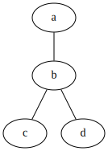

### Yönlü Graflar

Yönsüz graflara benzer şekilde DOT, akış çizelgeleri ve bağımlılık ağaçları gibi yönlü grafları da tanımlayabilir. Sözdizimi, grafa başlamak için `digraph` anahtar sözcüğünün kullanılması ve düğümler arasındaki ilişkileri göstermek için bir ok `->` kullanılması dışında yönsüz graflarla aynıdır.


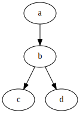

### Öznitellikler
DOT dosyalarındaki graflara, düğümlere ve kenarlara çeşitli öznitelikler uygulanabilir. Bu özniteliklerle renk, şekil ve çizgi stilleri gibi özellikler kontrol edebilir. Düğümler ve kenarlar için, bir veya daha çok öznitelik-değer çifti, köşeli parantez `[]` içinde bir ifadeden sonra ve isteğe bağlı olan noktalı virgül kullanılmışsa ondan önce yerleştirilir.

Graf özellikleri, graf öğesinin altında doğrudan öznitelik-değer çiftleri olarak belirtilir; burada birden çok özellik virgülle veya çoklu köşeli parantez kullanılarak ayrılır. Düğüm öznitelikleriyse yalnızca düğümün adını içeren, ancak noktalar arasındaki ilişkileri içermeyen bir ifadeden sonra yerleştirilir.


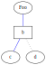

HTML benzeri etiketler, yalnızca Kasım 2003'ten sonraki Graphviz sürümlerinde bulunur ve 1.10 sürümünün bir parçası olarak kabul edilmez.

### Yorumlar

Dot, `C` ve `C++` tarzı tek satır ve çok satırlı yorumları destekler. Ayrıca, ilk karakterleri bir sayı işareti sembolü `#` olan satırlar da görmezden gelinir.

```dot
// Bu tek satırlı bir yorumdur
/* Bu bir
   çok satırlı
   yorumdur. */
# Bunun gibi satırlar da göz ardı edilir
```

## Örnekler

### Örnek 0. Merhaba Dünya

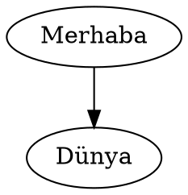

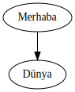

### Örnek 1. Basit bir graf


### Örnek 2. K6


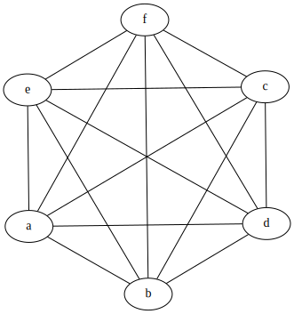

### Örnek 3. Basit bir yönlü graf


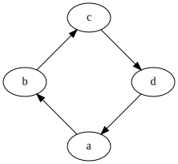

### Örnek 4. Ağırlıklı bir graf


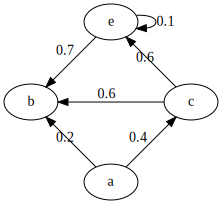

### Örnek 5. Bir yolun gösterimi


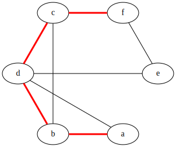

Aşağıdaki gibi bir kestirme yöntem bulunduğunu da unutmayın:


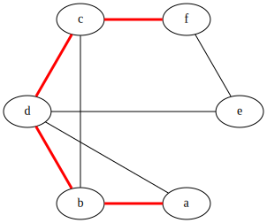

### Örnek 6. Alt graflar

Lütfen burada bazı tuhaflıklar olduğunu unutmayın. Öncelikle alt grafların adı önemlidir, görsel olarak ayrılması için, aşağıda gösterildiği gibi cluster_ ön adının eklenmesi gerekir. Ayrıca yalnızca DOT ve FDP yerleşim yöntemleri alt grafları desteklemektedir.


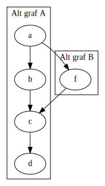

Aşağıdaki örnekteyse düğümler kendi kenarlarından ayrı olarak gruplandırılmıştır. Ayrıca splines=line; ile kenarların sadece düz çizgiler olarak çizilmesi gerektiğini, hiçbir eğriye izin verilmediği belirtilmiştir.

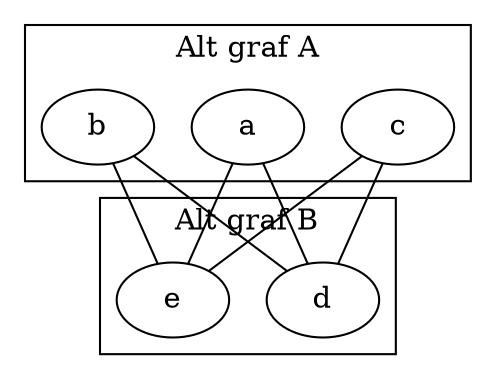

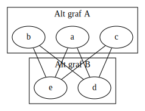

### Örnek 7. Büyük graflar

Büyük graf tanımlamalarını yazmayı kolaylaştırmak için kenarlar bir küme paranteziyle birlikte gruplanabilir. Ayrıca grafın yukarıdan aşağıya doğru yerleştirilmesi yerine soldan sağa doğru yerleştirilmesi de yardımcı olabilir.


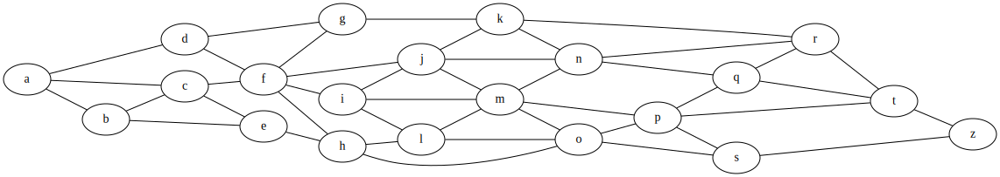

Büyük grafların yönetilebilir hale getirebilecek başka bir özellik de düğümleri aynı sütunda gruplamaktır:


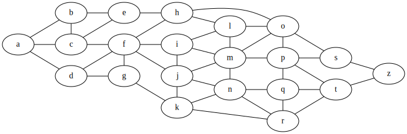

### Örnek 8. Etan molekülü

Aşağıda bir etan molekülünün bağ yapısını tanımlayan bir örnek kod verilmiştir. Bu, yönsüz bir graftır ve yukarıda açıklandığı gibi düğüm öznitelikleri içerir.


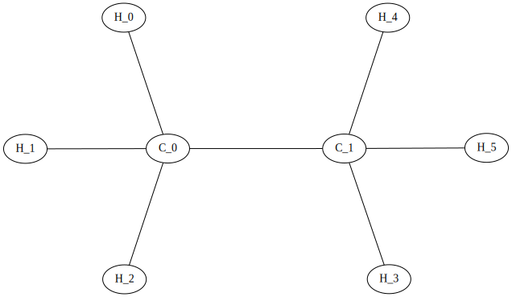

## Sınırlamalar
DOT ile yerleşim ayrıntılarını belirtmek mümkündür ancak DOT dilini gerçekleyen araçların tümü konum özelliklerine dikkat etmez. Bu nedenle, kullanılan araçlara bağlı olarak, kullanıcılar otomatik yerleşim algoritmalarına (potansiyel olarak beklenmeyen çıktılara yol açabilir) dayalı çözümler kullanmak veya sıkıcı olabilecek ve zaman alabilecek şekilde düğümleri elle konumlandırmak zorunda kalabilir.

Örneğin:


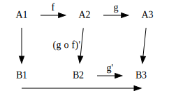

Yukarıdaki resimde iki sorun var. Sağdaki kare mükemmel bir kare değil ve etiketler yanlış yerde:

> Warning: Unable to reclaim box space in spline routing for edge "B1" -> "B3". Something is probably seriously wrong.

Bu sorun Inkscape veya diğer SVG düzenleyicilerle düzeltilebilir. Bazı durumlarda bu, bir konum belirtmek için pos özniteliği ve grafı kare olarak oluşturmak için weight özniteliği kullanılarak da düzeltilebilir.

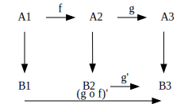

## Referans
Graflar ve köşeler (GraphViz notasyonunda düğümler) hem grafın asıl yerleşimini hem de renkler, etiketler ve çizgi türleri gibi ayrıntıları etkileyen çok sayıda özniteliğe sahip olabilir. Aşağıda özniteliklerden birkaçını ele alınmıştır ancak tam referans için [GraphViz Öznitelik Dizinine](http://graphviz.org/doc/info/attrs.html) bakın.

### Öznitellikler

#### Graf Öznitellikleri

- `label="Grafım";` Bir grafın kendisini etiketler
- `rankdir=LR;` Grafı yukarıdan aşağıya doğru değil soldan sağa doğru yerleştirir
- `{rank=ayni; a, b, c }` Düğümleri bir grafın aynı seviyesinde birlikte gruplar
- `splines="line";` Kenarları düz olmaya zorla, eğri veya açı yok
- `K=0.6;` Yerleşimde kullanılan 'spring''i etkilemek için kullanılır, özellikle `twopi` ve `sfdp` yerleşimleri için yararlı olan düğümleri daha da ileri itmek için kullanılabilir

#### Köşe Öznitellikleri

- `[label="Bir Etiken"]` Köşeyi etiketler
- `[color="red"]` Köşeyi renklendirir
- `[fillcolor="blue"]` Köşeyi belirtilen renkle doldurur

#### Kenar Öznitellikleri

- `[label="Bir Etiket"]` Kenarı etiketler (Ağırlıklar için yararlı olabilir)
- `[color="red"]` Kenarı renklendirir (Yollar için faydalı olabilir)
- `[penwidth=2.0]` Kenar çizgisinin kalınlığını ayarlar, yollar için çok yararlıdır

Kenarlar ayrıca `[weight=0.5]` şeklinde tanımlanabilen bir `weight` özniteliğine de sahip olabilir, ancak bunun ilgili yolun ağırlığını göstermek için olmadığına dikkat edin, bu ağırlık, ilgili kenara daha doğrudan bir yönlendirme vermesi için graf düzenine bir ipucudur.

### Graflar

Graflar, kenar listesine benzer şekilde epey standart sözdizimi kullanan bir `graph` veya `digraph` olarak tanımlanır.

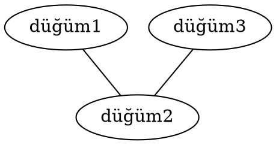

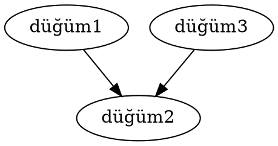

### Köşeler

Köşeler, `A, B, C, Test, Köşe1, bir_köşe` gibi basit bir düz metin etiketiyle tanımlanır. Daha karmaşık bir etikete ihtiyacınız varsa bir kenar tanımlamadan önce köşeyi deklare edebilir ve etiket özniteliğini belirtebilirsiniz. Örneğin:

```dot
digraph {
    someVertex[label="Karmaşık Bir Etiket"];
    someVertex -> node2;
    node2 -> node3;
}
```


### Kenarlar

Çoğunlukla kenarlarla ilgili endişe edilen sadece rengi, kalınlığı ve etiketidir. Geri kalan her şey graph/digraph tanımlamasıyla otomatik olarak halledilir.

Bir kenarı renklendirmek için [color özniteliğini](http://graphviz.org/doc/info/colors.html) graf tanımlamasına ekleyin:

```dot
digraph {
    node1 -> node2[color="red"];
}
```

Bir ağırlığı görüntülemek için köşelere düğümleri etiketleme şeklimize benzeyen bir etiket veriyoruz:

```dot
digraph {
    node1 -> node2[label="0.2"];
    node2 -> node3[label="0.2"];
}
```

Aslında bu şekilde kenara istediğimiz herhangi bir etiketi uygulayabiliriz:

```dot
digraph {
    node1 -> node2[label="edge1"];
    node2 -> node3[label="edge2"];
}
```

Bu öznitelikleri ayrıca istediğiniz şekilde birleştirebilirsiniz:

```dot
digraph {
    node1[label="Some Complicated Label"];
    node1 -> node2[label="An Edge",color=red];
    node2 -> node3;
}
```

## Yapılacaklar

Belge şu anda iş görecek tamlığa erişmiş durumda. Nihai tamlığa ulaşması için [Drawing graphs with dot](https://www.graphviz.org/pdf/dotguide.pdf) okunup önemli yerler belgeye aktarılacak.

## Kaynaklar

- [DOT (graph description language) - Wikipedia](https://en.wikipedia.org/wiki/DOT_(graph_description_language))
- [GraphViz Pocket Reference](https://graphs.grevian.org)
- [Graphviz Example: Hello World](https://graphviz.gitlab.io/_pages/Gallery/directed/hello.html)
- [DOT: A Language that Helps You to Draw Graphs](https://opensourceforu.com/2016/01/dot-a-language-that-helps-you-to-draw-graphs/)
- [Graphviz: Graf Görselleştirme Yazılımı 
](https://anilozbek.blogspot.com/2018/12/graphviz-graf-gorsellestirme-yazlm.html)
